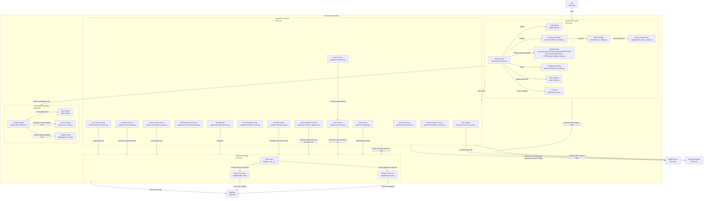

# Unnamed CodeViz Diagram

```mermaid
graph TD

    user["User<br>[External]"]
    database["Database<br>[External]"]
    update_server["Update Server<br>[External]"]
    operating_system["Operating System<br>[External]"]
    subgraph input_scan_app_boundary["Input Scan Application<br>[External]"]
        subgraph desktop_client_boundary["Desktop Client (UI)<br>[External]"]
            main_window["Main Window<br>/app/ui/main_window.py"]
            login_dialog["Login Dialog<br>/app/ui/login.py"]
            dashboard_window["Dashboard Window<br>/app/ui/dashboard_window.py"]
            metrics_widget["Metrics Widget<br>/app/ui/metrics_widget.py"]
            update_dialog["Update Dialog<br>/c:/Users/yahir/OneDrive/Escultorio/MES/SISTEMA DE SCANEO IMD/VISUAL CODEX/app/ui/update_dialog.py"]
            config_dialog["Configuration Dialog<br>/app/ui/configuracion_dialog.py"]
            metric_detail_window["Metric Detail Window<br>/app/ui/metric_detail_window.py"]
            style_manager["Style Manager<br>/app/ui/style.py"]
            log_tools["Log Tools<br>/app/ui/log_tools.py"]
            %% Edges at this level (grouped by source)
            main_window["Main Window<br>/app/ui/main_window.py"] -->|"Shows"| login_dialog["Login Dialog<br>/app/ui/login.py"]
            main_window["Main Window<br>/app/ui/main_window.py"] -->|"Displays"| dashboard_window["Dashboard Window<br>/app/ui/dashboard_window.py"]
            main_window["Main Window<br>/app/ui/main_window.py"] -->|"Shows if update available"| update_dialog["Update Dialog<br>/c:/Users/yahir/OneDrive/Escultorio/MES/SISTEMA DE SCANEO IMD/VISUAL CODEX/app/ui/update_dialog.py"]
            main_window["Main Window<br>/app/ui/main_window.py"] -->|"Shows"| config_dialog["Configuration Dialog<br>/app/ui/configuracion_dialog.py"]
            main_window["Main Window<br>/app/ui/main_window.py"] -->|"Applies styles from"| style_manager["Style Manager<br>/app/ui/style.py"]
            main_window["Main Window<br>/app/ui/main_window.py"] -->|"Uses for logging"| log_tools["Log Tools<br>/app/ui/log_tools.py"]
            dashboard_window["Dashboard Window<br>/app/ui/dashboard_window.py"] -->|"Contains"| metrics_widget["Metrics Widget<br>/app/ui/metrics_widget.py"]
            metrics_widget["Metrics Widget<br>/app/ui/metrics_widget.py"] -->|"Shows details for"| metric_detail_window["Metric Detail Window<br>/app/ui/metric_detail_window.py"]
        end
        subgraph app_services_boundary["Application Services<br>[External]"]
            auth_service["Auth Service<br>/app/services/auth.py"]
            auto_updater["Auto Updater<br>/app/services/auto_update.py"]
            counters_service["Counters Service<br>/app/services/counters.py"]
            db_optimizations_service["DB Optimizations Service<br>/app/services/db_optimizations.py"]
            db_optimizer["DB Optimizer<br>/app/services/db_optimizer.py"]
            direct_mysql_service["Direct MySQL Service<br>/app/services/direct_mysql.py"]
            dual_db_service["Dual DB Service<br>/app/services/dual_db.py"]
            local_queue_service["Local Queue Service<br>/app/services/local_queue.py"]
            metrics_cache_service["Metrics Cache Service<br>/app/services/metrics_cache.py"]
            parser_service["Parser Service<br>/app/services/parser.py"]
            scans_optimized_service["Scans Optimized Service<br>/app/services/scans_optimized.py"]
            scans_service["Scans Service<br>/app/services/scans.py"]
            simple_counters_service["Simple Counters Service<br>/app/services/simple_counters.py"]
            summary_service["Summary Service<br>/app/services/summary.py"]
            %% Edges at this level (grouped by source)
            parser_service["Parser Service<br>/app/services/parser.py"] -->|"Provides parsed data to"| scans_service["Scans Service<br>/app/services/scans.py"]
        end
        subgraph db_manager_boundary["Database Manager<br>[External]"]
            mysql_connector["MySQL Connector<br>/app/db/mysql_db.py"]
            sqlite_connector["SQLite Connector<br>/app/db/sqlite_db.py"]
            db_factory["DB Factory<br>/app/db/__init__.py"]
            %% Edges at this level (grouped by source)
            db_factory["DB Factory<br>/app/db/__init__.py"] -->|"Creates MySQL connection"| mysql_connector["MySQL Connector<br>/app/db/mysql_db.py"]
            db_factory["DB Factory<br>/app/db/__init__.py"] -->|"Creates SQLite connection"| sqlite_connector["SQLite Connector<br>/app/db/sqlite_db.py"]
        end
        subgraph config_manager_boundary["Configuration Manager<br>[External]"]
            config_manager_comp["Config Manager<br>/app/config_manager.py"]
            app_settings["App Settings<br>/app/config.py"]
            secure_config["Secure Config<br>/app/secure_config.py"]
            logging_config["Logging Config<br>/app/logging_config.py"]
            %% Edges at this level (grouped by source)
            config_manager_comp["Config Manager<br>/app/config_manager.py"] -->|"Loads settings from"| app_settings["App Settings<br>/app/config.py"]
            config_manager_comp["Config Manager<br>/app/config_manager.py"] -->|"Manages secure settings with"| secure_config["Secure Config<br>/app/secure_config.py"]
            config_manager_comp["Config Manager<br>/app/config_manager.py"] -->|"Applies logging settings from"| logging_config["Logging Config<br>/app/logging_config.py"]
        end
        %% Edges at this level (grouped by source)
        desktop_client_boundary["Desktop Client (UI)<br>[External]"] -->|"Calls functions in"| app_services_boundary["Application Services<br>[External]"]
        desktop_client_boundary["Desktop Client (UI)<br>[External]"] -->|"Reads configuration from"| config_manager_boundary["Configuration Manager<br>[External]"]
        app_services_boundary["Application Services<br>[External]"] -->|"Reads from and writes to | SQL"| db_manager_boundary["Database Manager<br>[External]"]
        auth_service["Auth Service<br>/app/services/auth.py"] -->|"Authenticates against"| db_manager_boundary["Database Manager<br>[External]"]
        scans_service["Scans Service<br>/app/services/scans.py"] -->|"Performs scan operations via"| db_manager_boundary["Database Manager<br>[External]"]
        scans_optimized_service["Scans Optimized Service<br>/app/services/scans_optimized.py"] -->|"Performs optimized scan operations via"| db_manager_boundary["Database Manager<br>[External]"]
        dual_db_service["Dual DB Service<br>/app/services/dual_db.py"] -->|"Manages operations across"| db_manager_boundary["Database Manager<br>[External]"]
        db_optimizer["DB Optimizer<br>/app/services/db_optimizer.py"] -->|"Optimizes"| db_manager_boundary["Database Manager<br>[External]"]
        metrics_cache_service["Metrics Cache Service<br>/app/services/metrics_cache.py"] -->|"Caches data from"| db_manager_boundary["Database Manager<br>[External]"]
        summary_service["Summary Service<br>/app/services/summary.py"] -->|"Generates summaries from"| db_manager_boundary["Database Manager<br>[External]"]
        local_queue_service["Local Queue Service<br>/app/services/local_queue.py"] -->|"Queues data for"| db_manager_boundary["Database Manager<br>[External]"]
    end
    %% Edges at this level (grouped by source)
    user["User<br>[External]"] -->|"Uses"| desktop_client_boundary["Desktop Client (UI)<br>[External]"]
    app_services_boundary["Application Services<br>[External]"] -->|"Checks for and downloads updates from | HTTP/SMB"| update_server["Update Server<br>[External]"]
    app_services_boundary["Application Services<br>[External]"] -->|"Interacts with | System Calls"| operating_system["Operating System<br>[External]"]
    db_manager_boundary["Database Manager<br>[External]"] -->|"Connects to | SQL"| database["Database<br>[External]"]
    desktop_client_boundary["Desktop Client (UI)<br>[External]"] -->|"Interacts with | System Calls"| operating_system["Operating System<br>[External]"]
    auto_updater["Auto Updater<br>/app/services/auto_update.py"] -->|"Communicates with"| update_server["Update Server<br>[External]"]
    mysql_connector["MySQL Connector<br>/app/db/mysql_db.py"] -->|"Connects to MySQL"| database["Database<br>[External]"]
    sqlite_connector["SQLite Connector<br>/app/db/sqlite_db.py"] -->|"Connects to SQLite"| database["Database<br>[External]"]

```
